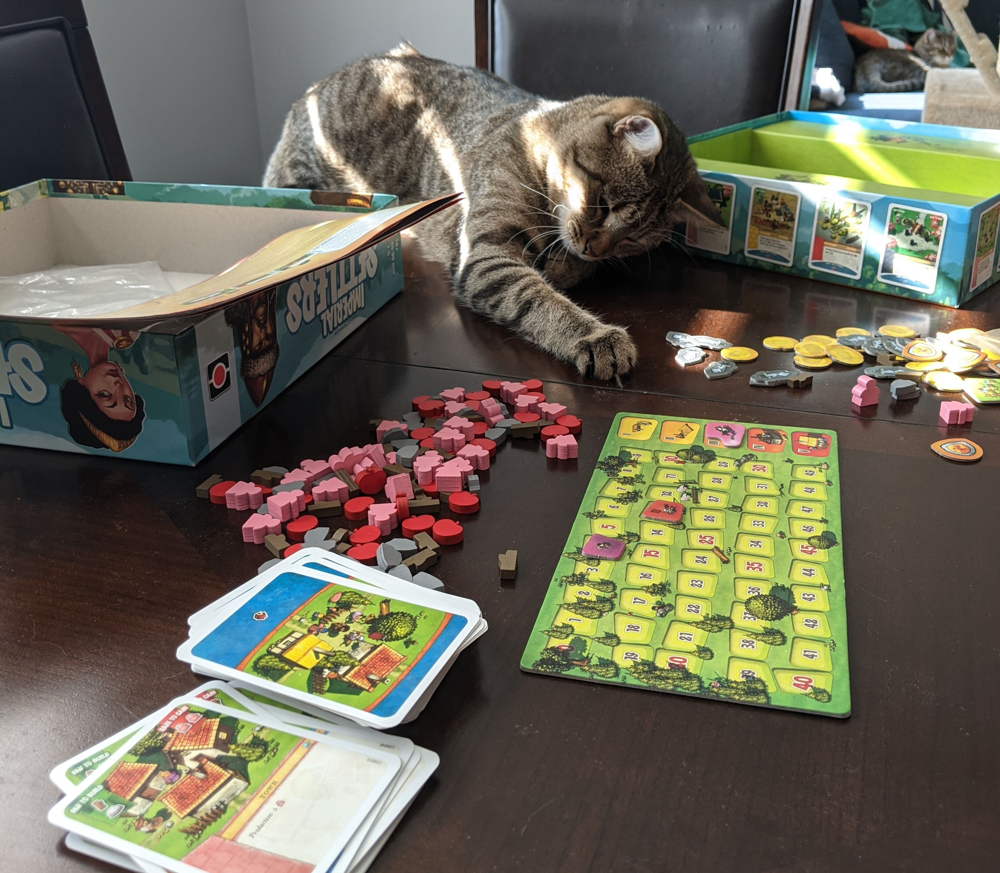

## My story
I'm a former particle physicist turned DFS pro. In addition to my successful career as a DFS and Bestball player, I enjoy building tools that help other players level up their game. See [My Work](./mywork.html) for some of the DFS and Bestball projects I've worked on. 

Some of my DFS and Bestball accomplishments include: 
- Two-time Milli-Maker winner
- 2024 Fantasy Baseball World Championship winner ($1M prize)
- 2024 Fantasy Foodball World Championship runner-up ($1M prize for second place)
- 2023 Best Ball Mania third-place finisher ($300K prize for third place)

Embed this tweet: 
https://x.com/ShaidyAdvice/status/1828225513174847644
<blockquote class="twitter-tweet">
Got to check “Win a DFS live final” off of my bucket list this weekend in Chicago. Thank you to all of you who congratulated me and as always to <a href="https://twitter.com/SaberSim?ref_src=twsrc%5Etfw">@SaberSim</a> and the great team working on their DFS product. <a href="https://t.co/3uOXdnlAJR">pic.twitter.com/3uOXdnlAJR</a>
&mdash; Shaidy Advice (@ShaidyAdvice) <a href="https://twitter.com/ShaidyAdvice/status/1828225513174847644?ref_src=twsrc%5Etfw">August 27, 2024</a></blockquote> 

# My Photo Gallery

  

    
    
Fantasy Baseball World Championship 2024

  

  

    
    
Fantasy Football World Championship 2024

  

  

    
    
Peaceful morning reflection

  

## Other interests
More stuff here about board games? cats? other? 

#### Cats interfering with PC gaming (to-do: Blur background of other screens)

#### Cats interfering with console gaming

#### Cats interfering with board gaming

## About the name
I get asked a lot where the name ShaidyAdvice comes from. I've used variants on Shaidar and Shaidy as a handle since about 2000, after [everyone's favorite Fade from Wheel of Time](https://wot.fandom.com/wiki/Shaidar_Haran). I became ShaidyAdvice during my first foray into online content creation: A series of tutorial videos for running successful raids in World of Warcraft. 
